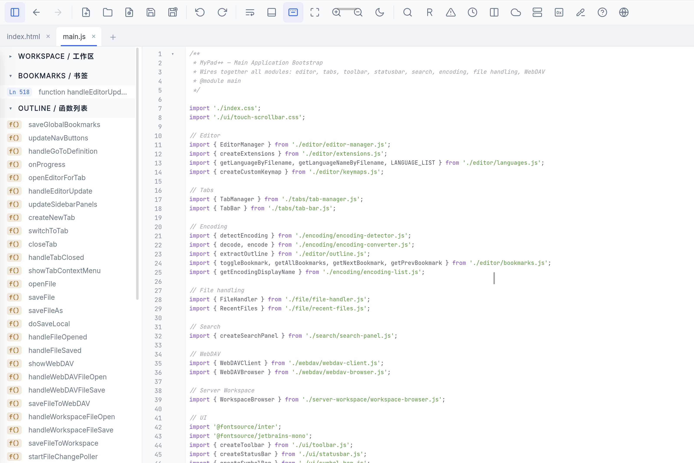
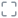

# MyPad++

English | [简体中文](README_zh.md)
MyPad++ is a modern, lightweight, and incredibly fast web-based code editor and text pad, designed with a focus on **tablet and mobile touch experiences**, while remaining fully capable on the desktop. It is built using Vanilla JavaScript, Vite, and CodeMirror 6, entirely without heavy frontend frameworks to ensure the lowest latency and minimal resource usage.

 

## 🌐 Live Demo / Try it Online

Experience MyPad++ instantly in your browser:
**👉 [https://mypad.almuszhang.workers.dev/](https://mypad.almuszhang.workers.dev/)**

*(Note: The online static version fully supports Local Files API and WebDAV connections. Node.js Server Workspace features require running the app locally.)*

<p align="center">
  
</p>

## ✨ Features

- **PWA & Touch Optimized:** Designed to run beautifully on Android/iPad tablets as a Progressive Web App (fullscreen immersive mode). Includes a "No Keyboard" toggle mode to comfortably scroll and read code without the virtual keyboard interrupting you.
- **Advanced Code Editing:** Powered by CodeMirror 6, featuring syntax highlighting for over 15+ languages, line numbers, code folding, auto-closing brackets, and multi-cursor block selections (Alt+Drag).
- **Dedicated Hex Editor:** Includes a high-performance, virtualized Hex Editor for modifying binary data with 16/32 byte layout options.
- **Side-by-Side Compare (Diff):** Built-in full-screen file comparison tool with bidirectional editing, quick line merging, and a "Show Only Diffs" toggle.
- **Responsive Global Search:** Features sequential multi-term fuzzy matching (e.g. `abc pdf`), Regex support, and "Find All" history.
- **Secure WebDAV & Remote Workspace:** Connect to WebDAV servers with local XOR password obfuscation, or use a custom Node.js workspace backend to edit code directly on your servers.
- **Cloud Bookmarks Sync:** Set bookmarks on lines of code and they automatically sync to the server, persisting across devices and sessions.
- **Custom Highlights:** Select text and instantly highlight it with custom colors (Red, Green, Blue, Yellow, etc.). Great for code reviewing or studying.
- **Local File System Access:** Securely open, edit, and save files straight to your local hard drive using the modern Native File System Access API.
- **File Change Detection:** Automatically detects if a file has been modified externally on the server and prompts you to compare or reload.
- **Multi-Tab Management:** Auto-saving sessions. Never lose your tabs or unsaved modifications when you accidentally close the browser.

## 📖 Usage & Icons

### Toolbar Actions

| Icon | Name | Description |
| :---: | :--- | :--- |
|  | **New File** | Create a new blank document. |
|  | **Open** | Open a file from your local hard drive. |
|  | **Save** | Save the current file. |
|  | **Save As** | Save the current file to a new location. |
|  | **Undo** | Undo the last action. |
|  | **Redo** | Redo the last undone action. |
|  | **Word Wrap** | Toggle word wrapping for long lines. |
|  | **Status Bar** | Show/hide the bottom status bar (encoding/cursor info). |
|  | **Virtual Keyboard** | Disable the auto pop-up of the on-screen keyboard (useful for tablets with physical keyboards). |
|  | **Fullscreen** | Enter immersive fullscreen mode, hiding the system status bar. |
|  /  | **Zoom In/Out** | Increase or decrease the editor font size. |
|  /  | **Theme** | Toggle between Light and Dark themes. |

### Advanced Features

| Icon | Name | Description |
| :---: | :--- | :--- |
|  | **File Explorer** | Slide-out sidebar to view workspace files. Right-click folders to "Pin to top". |
|  | **Find** | Powerful local search (Ctrl+F), supports regex. Defaults to an overview side panel. |
|  | **Replace** | Replace text within the current file. |
|  | **Next Error** | Jump to the next syntax error or warning. |
|  | **Compare Mode** | Side-by-side view to diff files intelligently. |
|  | **WebDAV** | Connect to a remote WebDAV server for remote file editing. |
|  | **Server Workspace** | Use a remote directory via Node.js as your local workspace. |
| **0x** | **Hex Editor** | Open the current file in a standalone virtualized Hex Viewer/Editor. |
|  | **Highlights** | Manage custom highlights. Select text and use the context menu to instantly colorize words. |

## 🚀 Getting Started

Follow these instructions to get a copy of the project up and running on your local machine for development and testing purposes.

### Prerequisites

You need to have **Node.js** (v16+ recommended) and **npm** installed on your system.
You can download it from [nodejs.org](https://nodejs.org/).

### Installation & Running Locally

1. **Clone the repository**
   ```bash
   git clone https://github.com/almus2zhang/mypad-.git
   cd mypad-
   ```

2. **Install dependencies**
   ```bash
   npm install
   ```

3. **Start the development server**
   ```bash
   npm run dev
   ```
   The terminal will output a local URL (e.g., `http://localhost:5173`). Open this URL in your web browser to use MyPad++.

### Building for Production

To build the app for production (generating static HTML/CSS/JS files):

```bash
npm run build
```

This will create a `dist/` folder containing the compiled, minified, and optimized static assets.

### Preview the Production Build

You can preview the built production app locally using:

```bash
npm run preview
```

### Running as a Background Service (Debian/Ubuntu Auto-Start)

The project includes a built-in Node.js server (`server.js`) that serves the production frontend (`dist/`) and provides backend workspace APIs.

To run the server continuously and start automatically on boot under a Debian/Ubuntu environment, you can use **PM2**:

1. **Install PM2 globally:**
   ```bash
   sudo npm install -g pm2
   ```

2. **Start the server with PM2:**
   Replace the workspace path and password with your desired values.
   ```bash
   # Run from the project root:
   pm2 start server.js --name "mypad" -- --workspace "/path/to/your/workspace" --password "your_password" --admin-port 3001
   ```
   > **Note:** The Admin Portal runs on port `3001` by default. You can change it using `--admin-port <port>`.

3. **Set PM2 to start on boot:**
   ```bash
   pm2 startup
   ```
   *Run the command outputted by the terminal to complete the setup.*

4. **Save the current process list:**
   ```bash
   pm2 save
   ```

Alternatively, you can manage it using **systemd**. Create a service file `/etc/systemd/system/mypad.service`:
```ini
[Unit]
Description=MyPad++ Server
After=network.target

[Service]
ExecStart=/usr/bin/node /absolute/path/to/mypad-/server.js --workspace "/path/to/workspace" --password "your_password" --admin-port 3001
Restart=always
User=your_username
Environment=PORT=3000

[Install]
WantedBy=multi-user.target
```
Then enable and start it: `sudo systemctl daemon-reload && sudo systemctl enable --now mypad`

## ☁️ WebDAV Configuration Guide

When connecting MyPad++ to a WebDAV server (such as via a reverse proxy like **Lucky** or Nginx), you must ensure that **CORS (Cross-Origin Resource Sharing)** is correctly configured, as browsers block cross-origin requests by default.

### 1. Enabling CORS for WebDAV
In your reverse proxy/WebDAV server configuration, ensure the following headers are appended to responses:

- `Access-Control-Allow-Origin`: `*` (or the specific domain hosting your MyPad++ instance)
- `Access-Control-Allow-Methods`: `OPTIONS, GET, HEAD, POST, PUT, DELETE, TRACE, COPY, MOVE, MKCOL, PROPFIND, PROPPATCH, LOCK, UNLOCK`
- `Access-Control-Allow-Headers`: `Authorization, Content-Type, Depth, Destination, Overwrite, x-requested-with, If-Match, If-None-Match, Cache-Control`
- `Access-Control-Expose-Headers`: `DAV, content-length, Allow`

**Important:** WebDAV relies heavily on the `PROPFIND` method to list directories. If you see an error like `Method PROPFIND is not allowed by Access-Control-Allow-Methods`, ensure `PROPFIND` is explicitly listed in the allowed methods.

### 2. Search Index Configuration
MyPad++ supports blazing-fast sequential multi-term fuzzy searching (e.g., typing `abc pdf` to match `*abc*pdf*`) for your remote files. Because WebDAV root directories can be massive, MyPad++ relies on a static JSON index file rather than traversing the entire WebDAV tree.

- The index file should be a JSON array of relative file paths.
- You can specify a **Custom Search Index URL** in the WebDAV connection dialog. This allows you to host the index file anywhere, even outside the WebDAV root directory.

#### Auto-generating the WebDAV Index
We provide an out-of-the-box Python background script located in the `scripts` directory of this repository. 
This script uses watchdog to monitor local filesystem changes and automatically regenerates the `webdav_index.json` file almost instantly whenever a file is modified!

**Configuration and Usage:**

1. Navigate to the `scripts` directory:
   ```bash
   cd scripts
   ```

2. Install the required dependencies:
   ```bash
   pip install watchdog
   ```

3. Copy the configuration example and edit it:
   ```bash
   cp config.json.example config.json
   ```
   **`config.json` details:**
   - `"output_file"`: The path to save the generated JSON file (should be accessible via your HTTP/HTTPS static server).
   - `"mappings"`: Configure the absolute local paths (`local_dir`) and their corresponding relative paths on the MyPad++ WebDAV client side (`webdav_prefix`). Multiple mappings are supported.
   - `"excludes"`: (Optional) Directories or file extensions to ignore (e.g., `.git`, `node_modules`). Filtering these will vastly improve search speed.

4. Run the background daemon:
   ```bash
   python webdav_indexer_daemon.py config.json
   ```
   *Tip: It's recommended to run this via `nohup`, `screen`, or `systemd` to keep it running in the background. Whenever changes occur in the mapped directories, a fresh index will be automatically generated for MyPad++!*

## 🛠️ Tech Stack

- **Core:** Vanilla JavaScript (ES Modules), HTML5, CSS3 (CSS Variables/Custom Properties)
- **Editor:** [CodeMirror 6](https://codemirror.net/)
- **Build Tool:** [Vite](https://vitejs.dev/)
- **Encoding:** `jschardet`, `iconv-lite`

## 📦 PWA Support

MyPad++ is fully equipped to be installed as a PWA. When accessing the site on a supported browser (like Chrome on Android or Safari on iOS), you can select **"Add to Home Screen"** to install it as a standalone app.

## 🤝 Contributing

Pull requests are welcome. For major changes, please open an issue first to discuss what you would like to change.

## 📄 License

This project is licensed under the MIT License.
